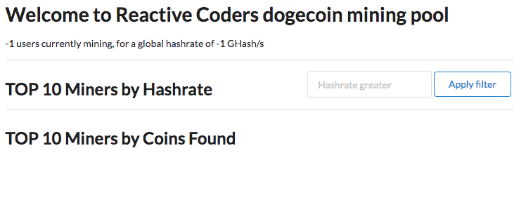
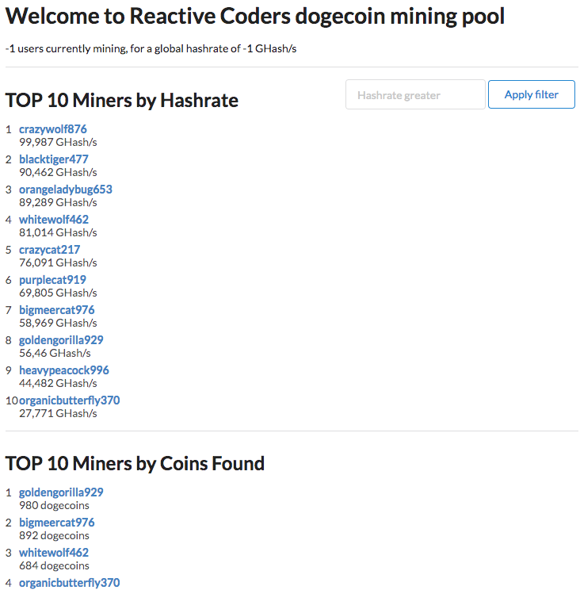
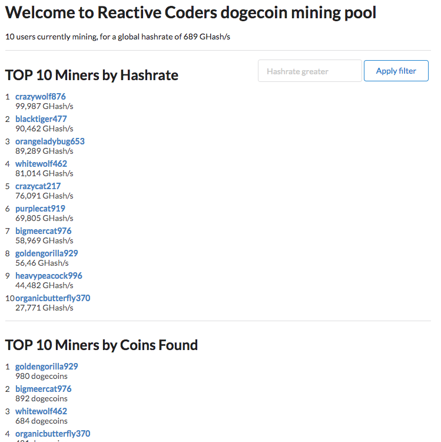

= Reactive Coding Workshop with Spring Boot: Lab docs
Mark Paluch <mpaluch@pivotal.io>;Simon Baslé <sbasle@pivotal.io>;
:revnumber: 1.0
:toc:
:toc-placement!:
:source-highlighter: pygments

(C) 2017 The original authors.

NOTE: _Copies of this document may be made for your own use and for distribution to others, provided that you do not charge any fee for such copies and further provided that each copy contains this Copyright Notice, whether distributed in print or electronically._

toc::[]
:sectnums:
:sectnumlevels: 2

== Lab Setup

=== Prerequisites

You need an installed JDK, at least Java 8. If you use https://git-scm.com/[Git], then you can checkout the Code using Git. You can also download the https://github.com/mp911de/reactive-coding-workshop/archive/master.zip[initial code] or https://github.com/mp911de/reactive-coding-workshop/archive/complete.zip[complete code] directly.

An installed IDE is recommended but not necessary. Having `cURL`, a browser or, any other sophisticated HTTP client installed is beneficial for issuing HTTP requests.

=== Register a GitHub account (Optional, recommended)
Go to https://github.com and signup for a free account. If you already have a GitHub account, you can skip this step.

=== Clone the Git repository

Clone the Reactive Coding Workshop with Spring Boot project using Git.

==== Console
Open a console and type the following command to clone the project:

.Cloning the Code Repository
====
[source,shell]
----
$ git clone https://github.com/mp911de/reactive-coding-workshop.git
----
====

==== Eclipse or STS


1. From the project explorer, right click, `Import`, `Git`, `Projects from Git`.
2. Select `Clone URI` and click `Next`.
3. Enter the URI https://github.com/mp911de/reactive-coding-workshop.git and click `Next`.
4. Select the master branch and click `Next` The projects will be imported.

NOTE: Note that depending on the version of Eclipse / STS, your version of Java, and other factors, you may encounter errors. These will need to be fixed on a case-by-case basis before proceeding.



==== IntelliJ IDEA


1. From the menu bar `VCS`, select `Checkout from Version Control`, `Github`.
2. Enter the URI https://github.com/mp911de/reactive-coding-workshop.git and click `Clone`.
3. The repository will be cloned.

=== IDE Import

=== Eclipse or STS

1. From the project explorer, right click, `Import`, `Maven`, `Existing Maven Projects`.
2. Navigate to the folder where you cloned the repository and `Finish`.
3. The projects will be imported.

Eclipse users wanting to use http://projectlombok.org[Lombok] need to install the Eclipse/Lombok plugin.
Run `lombok.jar` as a java app (i.e. double-click it, usually) to install. Also, add `lombok.jar` to your project. Supported variants: SpringSource Tool Suite, JBoss Developer Studio

NOTE: Note that depending on the version of Eclipse / STS, your version of Java, and other factors, you may encounter errors. These will need to be fixed on a case-by-case basis before proceeding.


=== IntelliJ IDEA

1. From the `File` menu select `Import Project` and navigate to wherever the course labs were installed during the previous step.

2. Click `Import project from external model` and import as Maven projects.

3. After clicking `Next`, select the `Search for projects recursively` checkbox.

4. Click `Next` again and several projects should be listed.

5. Click `Next` and select a suitable SDK.

6. Click `Next` one last time. You can leave the project name and location. Click Finish.


IntelliJ IDEA users wanting to use http://projectlombok.org[Lombok] need to install the Eclipse/Lombok plugin.
A https://plugins.jetbrains.com/plugin/6317?pr=idea[plugin developed by Michael Plushnikov] adds support for most features.

Congratulations! You have setup everything you will need for the rest of the course. The hard part is over!

== Runnable Application

*About this Lab*

You will learn how to start a reactive Spring Boot application

*Prerequisites*

To complete these steps, you will need:

1. The code checked out.
2. Optional: The code imported into your IDE.

**Estimated Duration**

_5 minutes_

*Steps*

1. The project contains a runnable application.
    * IDE: Navigate to the main class `ReactiveCodingWorkshopApplication`. Run this main class. The application will boot up and start a web server on port `8080`.

    * Maven users: Open a console and navigate to the code directory. Run `./mvnw spring-boot:run`

2. Navigate in your browser to the following endpoint:
 http://localhost:8080/

You should see something like:

[.thumb]

When you are done, stop the application.

Congratulations, you have finished this exercise.

== Get Comfortable with the Code

*About this Lab*

You will walk through the code to get familiar with the individual bits.

*Prerequisites*

To complete these steps, you will need:

1. The code checked out.
2. Optional: The code imported into your IDE.

**Estimated Duration**

_15 minutes_

*Steps*

1. Go to the package `org.dogepool.reactiveboot.config`. It contains the configuration classes to provide properties to the application and `WebConfig` to configure http://freemarker.org/[FreeMarker] for view template resolution.

2. Go to the package `org.dogepool.reactiveboot.domain`. This package contains the domain model: `UserStat` and `User` with an embedded `UserProfile`. `UserStat` and `User` are aggregate roots. `UserStatRepository` and `UserRepository` interact with the domain objects.

3. `org.dogepool.reactiveboot.view.model` contains `MinerModel` that is used to populate the view.

4. Now, go to `org.dogepool.reactiveboot.controller`. This package contains the controller classes that are exposed by Spring WebFlux as reactive HTTP endpoints.

5. Take a look at `org.dogepool.reactiveboot`. You will notice `DataInitializer`. Why is this class using `MongoTemplate`? I thought the workshop title said reactive coding? You're right! This class uses a blocking `MongoTemplate` inside a `@PostConstruct` method to load data into MongoDB. This code happens during initialization and there's not need to go async. As of now, you should not use reactive infrastructure because that performs work on other threads than the main thread while we're still in the initialization phase. Initialization means that Spring Framework holds some exclusive object locks that may cause locks which do not resolve (similar to a deadlock) therefore the only safe approach is using plain old blocking I/O. MongoDB is started as embedded process. And to be honest: You don't want to mess with reactive synchronization.

NOTE: Repositories are implemented by Spring Data MongoDB. Domain classes use http://projectlombok.org[Lombok] annotations to get rid of boilerplate code. Getter/Setter/Constructors and more are generated during runtime by the annotation processor.

NOTE: Did you notice that `src/test/java` contains a bunch of JUnit tests? These tests will guide you in the next steps towards the implementation and help to verify whether your implementation is correct. Don't worry, at this stage, the tests do not pass.

Congratulations, you have finished this exercise.

== First Steps with `Mono` and `Flux`

*About this Lab*

You will learn about `Mono` and `Flux` and their role as elementary reactive types. You will see how to create instances, compose a reactive sequence by applying operators and how to consume data.

*Prerequisites*

To complete these steps, you will need:

1. The code checked out.
2. The code imported into your IDE.

**Estimated Duration**

_25 minutes_

`Mono` and `Flux` are reactive types that emit `0..1` values and `0..1..N` values, respectively. They can be created as scalar values to just emit the provided value, from a `Callable` or as generator to provide a sink for processes that publish data to a target.

*Steps*

1. Go to `src/test/java` `org.dogepool.reactiveboot.GettingStartedTests`. There you find a couple of methods with `TODO` comments. Read each method's TODO description and solve the tasks.

2. `monoShouldCreateScalarValue`: Scalar `Mono` instances are created with the `Mono.just(…)` factory method. Replace `Mono.empty()` with `Mono.just("Hello, World")`.

3. `monoShouldMapValueToHelloWorld`: Values can be mapped using the `map` operators. Map the emitted value `Hello` to `Hello, World` using `mono = mono.map(s -> String.format("%s, World", s));`.

4. `monoShouldFlatMapValueToHelloWorld`: `map` is perfect to map a non-null value into another non-null value calling code that is likely not to block. However, some cases require further I/O or can lead to absence of values, or, the emission of many values. `Mono.then(…)` is the flap-map operator for this case. Apply it with `mono.then(s -> Mono.just(String.format("%s, World", s)));`.

5. `monoShouldDeferCallable`: You can create a `Mono` from a `Callable` to obtain a value applying reactive execution. Create a `Mono` from a `Callable` with `Mono.fromCallable(myValue)`.
A `Mono` can be created from other sources, like the first element in an `Iterable`, other ``Mono``s, a `Supplier`, a `CompletableFuture` and many more.

6. `monoShouldExecuteOnADifferentThread`: Until now, all operations ran on the same thread. `.subscribe()` on each invocation subscribed to the `Mono` and initiated execution. Because it's the same thread, you didn't run into background execution. Use a `Scheduler` to subscribe and publish elements on a different thread with ` mono.subscribeOn(elastic).publishOn(elastic)`.

7. It's likely that you don't see any output at all. This is, because subscription and execution are now separate threads. You don't await execution. You can block the calling thread to synchronize the result by appending `.block()` to `.subscribe()`. The method will wait up to 30 seconds for the result. Calling `.block` is a last resort if no other synchronization is possible. In general, avoid `.block()` because calling `.block()` in a code block that should be non-blocking, will enforce blocking whereas your intention in non-blocking programming is not to block non-blocking execution.

8. `fluxShouldCreateScalarValues`: Let's look at `Flux`. `Flux` is the type to emit multiple elements. Create a scalar `Flux` that emits `Hello` and `World` items with the `Flux.just(…)` factory method. Replace `Flux.empty()` with `Flux.just("Hello", "World")`.

9. `fluxShouldCreateHelloWorldFromIterable`: You can create `Flux` from various sources. A handy approach to use resolved ``Iterable``s of data (such as a `List` or `Set`) in a reactive flow is creating a `Flux` from an `Iterable` with `Flux.fromIterable(…)`. Replace `Flux.empty()` with `Flux.fromIterable(strings)`.

10. `fluxShouldConcatTwoMonos`: A common scenario in reactive programming is combination of multiple reactive types without enforcing synchronization. This step provides two ``Mono``s (which are a `Publisher` each) and they should be concatenated. Concat retains the order in which the `Publisher` emits its values. Use the `Flux.concat(…)` factory method by invoking `Flux.concat(hello, world)`. Another approach is using the `merge` operator. Emitted items from a `Publisher` merged with `.merge(…)` may interleave with other items.

11. `monoShouldEmitIndividualCharactersAsString`: A reactive sequence converts emitted elements by using `map` operator. A single element is accepted and a single converted (mapped) element is emitted – one in, one out. You might run into a scenario in which you require emission of many elements of one input element. Just think of accessing a data source. Accessing data can return multiple objects based on the query. For this case, apply the `flatMap` operator. The function applied with `flatMap` takes the original string and should emit each letter as `String`. You can use a neat reg-ex trick: `Flux.fromArray(s.split("|")`. So replace `Flux.empty()` with `mono.flatMap(s -> Flux.fromArray(s.split("")))`. Alternatively, did you know about the char stream from `String`? You can use it with `Flux.fromStream(s.chars().mapToObj(value -> String.valueOf((char) value)))`.

<<<

Your code could look like:

.GettingStartedTests.java
====
[source,java]
----
public class GettingStartedTests {

	@Test
	public void monoShouldCreateScalarValue() {

		Mono<String> mono = Mono.just("Hello, World");

		mono.subscribe(s -> System.out.println(s));
	}

	@Test
	public void monoShouldMapValueToHelloWorld() {

		Mono<String> mono = Mono.just("Hello");

		mono = mono.map(s -> String.format("%s, World", s));

		mono.subscribe(System.out::println);
	}

	@Test
	public void monoShouldFlatMapValueToHelloWorld() {

		Mono<String> mono = Mono.just("Hello");

		mono = mono.then(s -> Mono.just(String.format("%s, World", s)));

		mono.subscribe(System.out::println);
	}

	@Test
	public void monoShouldDeferCallable() {

		Callable<String> myValue = () -> "Hello, World";

		Mono<String> mono = Mono.fromCallable(myValue);

		mono.subscribe(System.out::println);
	}

	@Test
	public void monoShouldExecuteOnADifferentThread() {

		Scheduler elastic = Schedulers.elastic();

		Mono<String> mono = Mono.just("Hello, World");

		mono = mono.subscribeOn(elastic).publishOn(elastic);

		mono.doOnNext(s -> System.out.println(s)).subscribe().block();
	}

	@Test
	public void fluxShouldCreateScalarValues() {

		Flux<String> flux = Flux.just("Hello", "World");

		flux.subscribe(System.out::println);
	}

	@Test
	public void fluxShouldCreateHelloWorldFromIterable() {

		List<String> strings = Arrays.asList("Hello", "World");

		Flux<String> flux = Flux.fromIterable(strings);

		flux.subscribe(System.out::println);
	}

	@Test
	public void fluxShouldConcatTwoMonos() {

		Mono<String> hello = Mono.just("Hello");
		Mono<String> world = Mono.just("World");

		Flux<String> flux = Flux.concat(hello, world);

		flux.subscribe(System.out::println);
	}

	@Test
	public void monoShouldEmitIndividualCharactersAsString() {

		Mono<String> mono = Mono.just("Hello, World");

		Flux<String> flux = mono.map(s -> s.split("")).flatMap(Flux::fromArray);

		flux.subscribe(System.out::println);
	}
}
----
====

Congratulations, you have finished this exercise. Several factory methods such as `concat` and `merge` are also available on instances.

[[reactive-data-access]]
== Reactive Data Access

*About this Lab*

You will learn how to use reactive MongoDB repositories and how to create reactive repository query methods.

*Prerequisites*

To complete these steps, you will need:

1. The code checked out.
2. The code imported into your IDE.

**Estimated Duration**

_10 minutes_

*Creating repository query methods*

Reactive query methods work pretty much the same as blocking repository query methods. Spring Data identifies reactive repositories by the use of reactive types in method signatures. Declaring a repository that extends `ReactiveCrudRepository` will inherit all declared methods and Spring Data will implement that repository using reactive infrastructure. Reactive repositories *must* use reactive result types, methods _can_ accept reactive types (`Mono`, `Flux`) or resolved parameters (`String`, `int`, …).

Spring Data executes either a single element query or a collection query based on the return type characteristics. `Mono` leads to a single element query, `Flux` can return many elements.

*IndexController*

The `IndexController` populates a `Model` and returns view name for the web application.

*Steps*

1. Go to `IndexController`. The code contains three ``TODO``s. Focus only on the upper two ``TODO``s providing values for `hashLadder` and `coinsLadder` attributes.

2. `hashLadder` contains the top-10 users ordered by their hash rate, highest first. Stats regarding the hashrate are stored in `UserStat` and can be accessed through `UserStatRepository`.

3. Go to `UserStatRepository` and create a reactive repository query method to return the top 10 `UserStat` objects ordered by `hashrate` (descending). The method would be named `findTop10ByOrderByHashrateDesc`.

4. `coinsLadder` in `IndexController` contains the top-10 users ordered by their mined coins, highest first. Stats regarding the mined coins are stored in `UserStat` and can be accessed through `UserStatRepository`.

5. Go to `UserStatRepository` and create a reactive repository query method to return the top 10 `UserStat` objects ordered by `totalCoinsMined` (descending). The method would be named `findTop10ByOrderByTotalCoinsMinedDesc`.

6. Now go back to `IndexController` and wire the repository query methods to the model attributes. Spring WebFlux accepts reactive types in the `Model`.

.IndexController.java
====
[source,java]
----
@FieldDefaults(level = AccessLevel.PRIVATE, makeFinal = true)
@RequiredArgsConstructor
@Controller
public class IndexController {

	UserStatRepository userStatRepository;
	DogeProperties dogeProperties;

	@GetMapping("/")
	String getIndex(Model model) {

		model.addAttribute("poolName", dogeProperties.getPoolName());

		model.addAttribute("hashLadder",
				userStatRepository.findTop10ByOrderByHashrateDesc());

		model.addAttribute("coinsLadder",
				userStatRepository.findTop10ByOrderByTotalCoinsMinedDesc());

		// TODO: Calculate the overall gigaHashrate and miningUserCount taking
		// a reactive approach
		model.addAttribute("gigaHashrate", -1d);
		model.addAttribute("miningUserCount", -1);

		return "index";
	}
}
----
====

.UserStatRepository.java
====
[source,java]
----
public interface UserStatRepository extends ReactiveCrudRepository<UserStat, ObjectId> {

	Flux<UserStat> findTop10ByOrderByHashrateDesc();

	Flux<UserStat> findTop10ByOrderByTotalCoinsMinedDesc();
}
----
====

Congratulations, you have finished this exercise.

**Bonus**

1. Run `IndexControllerIntegrationTests` to verify that 3 of 4 tests pass. `IndexControllerIntegrationTests.indexModelShouldProvideModelAttributes` fails because Step 6 is not completed yet.
2. Start now the application again. You will notice the start page has changed.

[.thumb]

**Bonus**

1. Did you notice the `Hashrate greater` filter? And did you notice, there's no code yet to handle the filtering? Do you want to fix that issue?
2. Extend `IndexController` to take a non-mandatory numeric request parameter `hashFilter` and filter the two streams where `UserStats#Hashrate` is greater `hashFilter`. How many approaches can you find to do so?
3. The `input` element should retain the previously entered value. Can you figure out how to do so by changing `Model` contents and `index.ftl`?
4. Start now the application again and check whether your changes have been successful.
5. You will notice that the subsequent code samples in the lab docs do not contain code to solve this bonus.

== Reactive Computations

*About this Lab*

In this lab you'll learn how to apply statistic computation in a deferred flow.

*Prerequisites*

To complete these steps, you will need:

1. Step 5, <<reactive-data-access>> completed

**Estimated Duration**

_15 minutes_

*Missing Bits on the Index Page*

The index page shows `-1` for `gigaHashrate` and `miningUserCount`. Both values require statistical computation based on the data in `UserStat`. That's a sum of all hash rates and the user count. Spring WebFlux synchronizes computation of reactive types first before the actual model evaluation. That behavior allows setting values in a reactive flow. The computation in this lab should remain non-blocking and take advantage of the callback methods provided by the reactive types.

This lab has multiple valid solutions.

*Steps*

1. Go to `IndexController` and implement a computation to provide values for `gigaHashrate` and `miningUserCount`.
2. `Flux` provides callback methods for functions invoked on each published element. Expect the callback to happen on a different thread, maybe even callbacks by multiple threads at the same time. The attributes `gigaHashrate` and `miningUserCount` summarize the number of users and the hash rate. Did you use `AtomicLong`/`AtomicInteger` already? Both types are atomic counters for lock-free counting. Create  `AtomicLong hashrate` and `AtomicInteger users` variables and increment the values by applying a function with the `doOnNext` operator.
3. The actual model values can be set on `Flux` completion. Set the model attributes by applying a function with the `doOnComplete` operator.
4. Spring WebFlux requires the `Flux` in the model to synchronize execution. Add the `Flux` to the `Model`, the attribute name has no significance and can be any `String`.
5. Start now the application again. You will notice the start page has changed.

[.thumb]

<<<

Your code could look like:

.IndexController.java
====
[source,java]
----
@FieldDefaults(level = AccessLevel.PRIVATE, makeFinal = true)
@RequiredArgsConstructor
@Controller
public class IndexController {

	UserStatRepository userStatRepository;
	DogeProperties dogeProperties;

	@GetMapping("/")
	String getIndex(Model model) {

		model.addAttribute("poolName", dogeProperties.getPoolName());

		model.addAttribute("hashLadder",
				userStatRepository.findTop10ByOrderByHashrateDesc());

		model.addAttribute("coinsLadder",
				userStatRepository.findTop10ByOrderByTotalCoinsMinedDesc());

		AtomicLong hashrate = new AtomicLong();
		AtomicInteger users = new AtomicInteger();

		Flux<UserStat> userStatFlux = userStatRepository.findAll()
				.doOnNext(userStat -> hashrate.addAndGet((long) userStat.getHashrate()))
				.doOnNext(userStat -> users.incrementAndGet()).doOnComplete(() -> {

					model.addAttribute("gigaHashrate", hashrate.doubleValue());
					model.addAttribute("miningUserCount", users.get());
				});

		model.addAttribute("userStatFlux", userStatFlux);

		return "index";
	}
}
----
====

Congratulations, you have finished this exercise.

**Bonus**

1. Run `IndexControllerIntegrationTests` to verify that all tests pass.

[[miner-detail-page]]
== Miner Detail Page

*About this Lab*

You will learn how to combine objects emitted from multiple publishers and combined to create a composite result with reactive types.

*Prerequisites*

To complete these steps, you will need:

1. Step 5, <<reactive-data-access>> completed

**Estimated Duration**

_10 minutes_

*Miner Page*

The miner detail page shows details about the miner along with some stats. The miner details are available through `User`, stats from `UserStat`. `UserStat.id` is not the user id but a database-specific identifier. That's why `UserStatRepository` requires a new repository query method to look up `UserStat` by user id.

*Steps*

1. Go to `UserStatRepository` and add a new repository query method to look up `UserStat` by `UserId` returning a single element.
2. Go to `MinerController` and fetch `User` from `UserRepository` and `UserStat` from `UserStatRepository`. Combine the publishers to a tuple and map the resulting `User` and `UserStat` objects into `MinerModel` with `MinerModel.of(…)`.
3. Start now the application again. Click on a miner once the page has loaded.

[.thumb]

<<<

Your code could look like:

.MinerController.java
====
[source,java]
----
@Controller
@FieldDefaults(level = AccessLevel.PRIVATE, makeFinal = true)
@RequiredArgsConstructor
public class MinerController {

	UserRepository userRepository;
	UserStatRepository userStatRepository;

	@GetMapping("/miner/{id}")
	String getMiner(@PathVariable String id, Model model) {

		Mono<MinerModel> compositeModel = userRepository.findOne(id)
				.and(user -> userStatRepository.findByUserId(user.getId()))
				.map(tuple -> MinerModel.of(tuple.getT1(), tuple.getT2()));

		model.addAttribute("model", compositeModel);

		return "miner";
	}
}
----
====

Congratulations, you have finished this exercise.

= Bonus

These are bonus steps explaining advanced reactive programming model patterns.

== Rank on Miner Detail Page

*About this Lab*

You will learn how to apply stream processing for long-running tasks that process potentially huge data sets.

*Prerequisites*

To complete these steps, you will need:

1. Step 5, <<reactive-data-access>> completed
2. Step 7, <<miner-detail-page>> completed

*Miner Page*

The miner detail page shows ranking by coins and by hash rate. These values derive from the state of the system, in particular the coins and hash rates of all users. These details aren't something that is computed on the fly but rather refreshed in certain intervals. For this workshop, we can use Spring WebFlux to trigger processing because we don't want to establish a complex scheduling infrastructure.

*Maintenance Job: CalculateRanks*

The goal is to create a maintenance job that can be started any time and that processes the whole user base, updating `UserStat` ranks.

*Steps*

1. Create a new package `org.dogepool.reactiveboot.service` with a new `@Component` class named `CalculateRanks`.
2. Use `ReactiveMongoTemplate` to iterate over `UserStat`. Using a MongoDB query with the appropriate sort order helps to retrieve results in the order of ranking. Make sure that results are published on a single thread (see `Schedulers.single()`). Using two distinct reactive flows might be the simpler approach than a combined attempt to calculate both ranks in a single pass.
3. Use `flatMap(…)` and an `AtomicLong` counter to increment the rank counter. Update `UserStat` selectively by setting just the rank property.
4. Repeat for the other rank property.
5. Synchronize both `Flux` with `Flux.merge(…)` returning the `.count()`.
6. Go to `MaintenanceController` and wire the dependency to `CalculateRanks`. Call the method to recalculate the ranks.
7. Invoke the maintenance job with `cURL` or your browser.
8. Start now the application again. Click on a miner once the page has loaded.

[.thumb]

.Example cURL Request
====
[source,shell]
----
curl -X POST http://localhost:8080/maintenance/ranks
----
====

<<<

Your code could look like:

.MaintenanceController.java
====
[source,java]
----
@RestController
@FieldDefaults(level = AccessLevel.PRIVATE, makeFinal = true)
@RequiredArgsConstructor
public class MaintenanceController {

	CalculateRanks calculateRanks;

	@PostMapping("maintenance/ranks")
	public Mono<Long> recalculateRanks() {

		return calculateRanks.recalculateRanks();
	}
}
----
====

.CalculateRanks.java
====
[source,java]
----
@Component
@FieldDefaults(level = AccessLevel.PRIVATE, makeFinal = true)
@RequiredArgsConstructor
public class CalculateRanks {

	ReactiveMongoTemplate mongoTemplate;

	public Mono<Long> recalculateRanks() {
		return Flux.merge(updateRankByHash(), updateRankByCoins()).count();
	}

	private Flux<UpdateResult> updateRankByCoins() {

		Query query = new Query().with(new Sort(Direction.DESC, "totalCoinsMined"));
		AtomicLong atomicLong = new AtomicLong();

		return mongoTemplate
				.find(query, UserStat.class)
				.publishOn(Schedulers.single())
				.flatMap(
						userStat -> {

							long rank = atomicLong.incrementAndGet();

							Query userStatQuery = new Query(Criteria.where("id").is(
									userStat.getId()));

							return mongoTemplate.updateFirst(userStatQuery,
									new Update().set("rankByCoins", rank), UserStat.class);
						});
	}

	private Flux<UpdateResult> updateRankByHash() {

		Query query = new Query().with(new Sort(Direction.DESC, "hashrate"));
		AtomicLong atomicLong = new AtomicLong();

		return mongoTemplate
				.find(query, UserStat.class)
				.publishOn(Schedulers.single())
				.flatMap(
						userStat -> {

							long rank = atomicLong.incrementAndGet();

							Query userStatQuery = new Query(Criteria.where("id").is(
									userStat.getId()));

							return mongoTemplate.updateFirst(userStatQuery,
									new Update().set("rankByHash", rank), UserStat.class);
						});
	}
}
----
====

Congratulations, you have finished this exercise.

== Reactive Micro-Proxy

*About this Lab*

You will learn how to use Spring 5's functional `WebClient` to set up a reactive microproxy.

*Prerequisites*

To complete these steps, you will need:

1. Step 5, <<reactive-data-access>> completed
2. Step 7, <<miner-detail-page>> completed

*Miner Page*

Did you notice the avatar image source? It points to `https://randomuser.me/api/portraits/…`. Using external data sources with client-side applications might require CORS if resources are scripts or accessed through JavaScript. Let's create a micro-proxy and adjust the miner view template to point towards our micro-proxy.

*Spring 5's functional `WebClient`*

Spring Framework 5 comes with a functional `WebClient` that integrates with Project Reactor's HTTP client for reactive HTTP communication. `WebClient` can be used together with Spring WebFlux to proxy requests to a different host and stream back results.

*Steps*

1. Go to `MinerController` and create two handler methods, one mapped to `GET /miner/{id}/avatar` and the other mapped to `/miner/{id}/avatar/small` Returning `Mono<ResponseEntity<Flux<ByteBuffer>>>` is a good idea because HTTP response headers (`Content-Type`) should be set.
2. Create a `WebClient` instance initialized at instance-level with `WebClient.builder().clientConnector(new ReactorClientHttpConnector()).build()`.
3. Implement the mapped methods: Lookup `User` by `id` from the URL mapping. Fetch the `UserProfile` and request the avatar URL with `WebClient`.
4. Initiate web exchange and map the result.  Construct `HttpHeaders` by extracting the `Content-Type` header from the proxy target request so the current response passes the header value through. Return the response status and body as `ByteBuffer` (`ClientResponse.bodyToFlux(ByteBuffer.class)`) inside a `ResponseEntity`.
5. Go to `src/main/resources/templates/miner.ftl`. Replace the avatar image URL to point to `/miner/${model.nickname}/avatar` and small avatar to `/miner/${model.nickname}/avatar/small`.
6. Start now the application again. Click on a miner once the page has loaded. Inspect the avatar image sources.

<<<

Your code could look like:

.MinerController.java
====
[source,java]
----
@Controller
@FieldDefaults(level = AccessLevel.PRIVATE, makeFinal = true)
@RequiredArgsConstructor
public class MinerController {

	UserRepository userRepository;
	UserStatRepository userStatRepository;
	WebClient webClient = WebClient.builder()
			.clientConnector(new ReactorClientHttpConnector()).build()
			.filter(userAgent());

	@GetMapping("/miner/{id}")
	String getMiner(@PathVariable String id, Model model) {

		Mono<MinerModel> compositeModel = userRepository.findOne(id)
				.and(user -> userStatRepository.findByUserId(user.getId()))
				.map(tuple -> MinerModel.of(tuple.getT1(), tuple.getT2()));

		model.addAttribute("model", compositeModel);

		return "miner";
	}

	@GetMapping("/miner/{id}/avatar")
	@ResponseBody
	Mono<ResponseEntity<Flux<ByteBuffer>>> getAvatar(@PathVariable String id) {
		return fetchAvatar(userRepository.findOne(id).map(User::getUserProfile)
				.map(UserProfile::getAvatarUrl));
	}

	@GetMapping("/miner/{id}/avatar/small")
	@ResponseBody
	Mono<ResponseEntity<Flux<ByteBuffer>>> getSmallAvatar(@PathVariable String id) {
		return fetchAvatar(userRepository.findOne(id).map(User::getUserProfile)
				.map(UserProfile::getSmallAvatarUrl));
	}

	private Mono<ResponseEntity<Flux<ByteBuffer>>> fetchAvatar(Mono<String> map) {

		return map.then(s -> webClient.get().uri(s).exchange()) //
				.map(resp -> {

					HttpHeaders headers = new HttpHeaders();

					Optional<MediaType> asString = Optional.ofNullable(resp.headers()
							.asHttpHeaders().getContentType());
					headers.add(HttpHeaders.CONTENT_TYPE, asString
							.map(MimeType::toString).orElse(MediaType.IMAGE_JPEG_VALUE));

					return new ResponseEntity<>(resp.bodyToFlux(ByteBuffer.class),
							headers, resp.statusCode());

				});
	}

	private ExchangeFilterFunction userAgent() {

		return (clientRequest, exchangeFunction) -> {
			ClientRequest newRequest = ClientRequest.from(clientRequest)
					.header("User-Agent", "Spring Framework WebClient").build();
			return exchangeFunction.exchange(newRequest);
		};
	}
}
----
====

Congratulations, you have finished this exercise.
